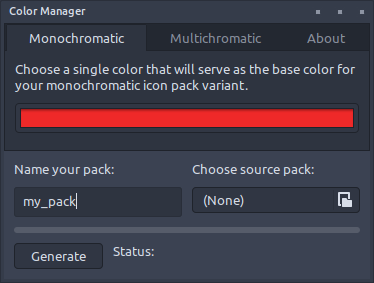
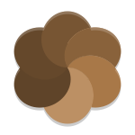
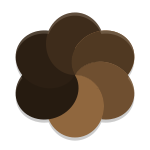
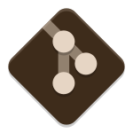
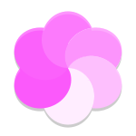
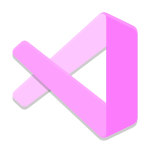

# Color Manager 

[Roadmap](#roadmap) | [Features](#features) | [Packs](#packs) | [Requests](#requests)

Color Manager is a program for recoloring existing svg-based icon packs as well as themes. The program is designed for [NovaOS](https://github.com/NicklasVraa/NovaOS) and is currently in **early development**. The first release will be late August 2023.

In the meantime, this repository will act as a preview and be home to recolorings of icon packs that are generated by the program during testing. Feel free to request a variant of any publically available icon pack. The released packs are hosted on [Google Drive](https://drive.google.com/drive/folders/1PxN_xtd-8F6M6SU2Ia1yOs4M1Mpy6arj)

## Roadmap 
- [x] Basic framework for manipulating icon packs.
- [x] Grayscale, monochromatic and multichromatic recoloring functions.
- [x] Command-line interface.
- [x] Graphical user interface based on the GTK framework.
- [ ] Basic framework for manipulating GTK, Cinnamon and Metacity themes.
- [ ] Intelligent color inversion function.
- [ ] Function for adding basic geometry to the backgrounds of icons.
- [ ] Python pip package.
- [ ] GNU/Linux AppImage.

## Features 
Currently, three types of recoloring operations are supported:
| Type        | Input              | Speed            |
| ----------- | ------------------ | ---------------- |
| Grayscale   | pack               | ~10000 icons/sec |
| Monochrome  | pack, hex-color    | ~500 icons/sec   |
| Multichrome | pack, palette-file | ~50 icons/sec    |

Speeds were recorded with an Intel i7-4770K CPU. Any svg-based icon pack can serve as the base for any color palette or monotone. For the best result when doing monochromatic recoloring, a pack where all icons have the same average saturation and lightness is recommended.

A simple GUI is included with the program, but it is also possible to interact with it from a command line. The GUI will adopt your active theme.

## Pack Previews 
Click sections to expand.

<b>Papirus-Mini Mono- and Multichromatic Variants</b>

The original papirus set is massive (>100MB), so this version has been simplified, e.g. icons no longer have multiple versions for slightly different icon sizes. As a result, it only takes up ~10MB when zipped.

| Name  | Examples | Status |
| ----- | -------- | -------|
| Original |         | [Source](https://github.com/PapirusDevelopmentTeam/papirus-icon-theme) |
| Nord |         | Finished |
| Dracula |         | Released |
| Catppuccin |         | Released |

| Name  | Examples | Status |
| ----- | -------- | -------|
| Galactic |         | Released |
| Strawberry |         | Released |
| Amazon |         | Finished |
| Pacific |         | Finished |
| Cobalt |         | Finished |
| Bumblebee |         | Released |
| Goldenrod |         | Released |
| Toffee |         | Finished |
| Coppertone |         | Finished |
| Tavern |         | Finished |
| Bubblegum |         | Finished |

## Requests 
Until the release of Color Manager, I will be taking requests for icon packs and recolorings. Simply submit a feature request here on the repository containing the following:
- The name of an open-source icon pack that will serve as the base look.
- For a monochromatic variant, a single hexadecimal value representing a color.
- For particular color palettes, a list of hexadecimal values or the name of a popular palette.

Please star the repository or consider donating, and I will upload your requested variant. Also consider showing the creators of the original icon packs some love. <3

**User-submitted color palettes**:
- [x] Nord
- [x] Dracula
- [x] Catpuccin
- [ ] Gruvbox
- [ ] Tokyo Night
- [ ] Onedark

**User-submitted color styles**:
- [x] Papirus
- [ ] Zafiro
- [ ] Breeze
- [ ] Adwaita

---
**Legal Notice**: This repository, including any and all of its forks and derivatives, may NOT be used in the development or training of any machine learning model of any kind, without the explicit permission of the owner of the original repository.
