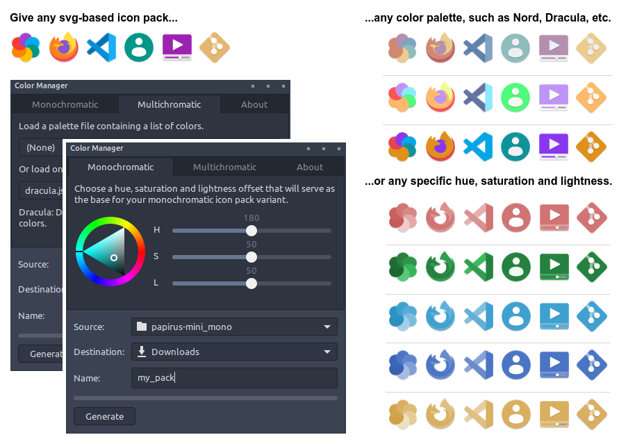

# Color Manager 

[Roadmap](#roadmap) | [Features](#features) | [Use](#use) | [Requests](#requests) | [Contribute](#contribute)

Color Manager is a program for recoloring existing svg-based icon packs as well as themes. The program is designed for [NovaOS](https://github.com/NicklasVraa/NovaOS) and is currently in **early development**. The first release will be late August 2023. In the meantime, this repository will act as a preview.




**Note**: If you publish an icon- or theme pack variant that was generated using this program, make sure to credit the original creator and this repository.


## Roadmap <a name="roadmap"></a>
- [x] Basic framework for manipulating icon packs.
- [x] Grayscale, monochromatic and multichromatic recoloring functions.
- [x] Command-line interface.
- [x] Graphical user interface based on the GTK framework.
- [ ] Basic framework for manipulating GTK, Cinnamon and Metacity themes.
- [ ] Intelligent color inversion function.
- [ ] Function for adding basic geometry to the backgrounds of icons.
- [ ] Python pip package.
- [ ] GNU/Linux binary.


## Features <a name="features"></a>
Currently, two types of recoloring operations are supported:
| Type        | Result | Speed            |
| ----------- | ------ | ---------------- |
| Monochrome  | A monochromatic variant, colored by appropriate shades of the provided base color. | ~5000 icons/sec |
| Multichrome | A multichromatic variant, where all colors are replaced by their nearest perceived equivalent that adheres to the provided color palette. | ~70 icons/sec |

Speeds were recorded with an Intel i7-4770K CPU. Any svg-based icon pack can serve as the base for any color palette or base color. For the best result when doing monochromatic recoloring, a pack where all icons have the same average saturation and lightness is recommended.


## Using the Program<a name="use"></a>
Either import `recolor` into your own script and call the recoloring functions, e.g.:
```python
from color_manager import recolor as rc
```
```python
src     = "packs/papirus-mini_mono"
name    = "my_mono_pack"
dest    = "~/Downloads"
hsl     = (0.5, 0.5, 0.5) # = rc.normalize_hsl(180, 50, 50)

rc.monochrome_pack(src, dest, name, hsl)
```
```python
src     = "packs/papirus-mini_multi"
name    = "my_multi_pack"
dest    = "~/Downloads"
palette = "palettes/dracula.json"

rc.multichrome_pack(src, dest, name, palette)
```

Or launch the GUI by running `python3 color_manager/gui.py` in a terminal from the project's root directory. The GUI will adopt your active theme. Dependencies: `colormath` and `tqdm`. For the GUI, `pygobject` (GTK bindings) must also be installed.


## Requests <a name="requests"></a>
Until the release of Color Manager, I will be taking requests for icon packs and recolorings. Simply submit a feature request here on the repository containing the following:
- The name of an open-source icon pack that will serve as the base look.
- For a monochromatic variant, a single hexadecimal value representing a color.
- For particular color palettes, a list of hexadecimal values or the name of a popular palette.

Please star the repository or consider donating, and I will upload your requested variant. Also consider showing the creators of the original icon packs some love.

Preview and download already fullfilled requests here:
<details>
<summary><b>Papirus-Mini Mono- and Multichromatic Variants</b></summary>
The original papirus set is massive (>100MB), so this version has been simplified, e.g. icons no longer have multiple versions for slightly different icon sizes. As a result, it only takes up ~10MB when zipped.

| Name  | Examples | Status |
| ----- | -------- | -------|
| Original |         | [Source](https://github.com/PapirusDevelopmentTeam/papirus-icon-theme) |
| Nord |         | Finished |
| Dracula |         | Released |
| Catppuccin |         | Released |

| Name  | Examples | Status |
| ----- | -------- | -------|
| Galactic |         | Released |
| Strawberry |         | Released |
| Amazon |         | Finished |
| Pacific |         | Finished |
| Cobalt |         | Finished |
| Bumblebee |         | Released |
| Goldenrod |         | Released |
</details>


## Contribute <a name="contribute"></a>
If you are experienced with packaging projects such as this for easy distribution, please contact me.

---
**Legal Notice**: This repository, including any and all of its forks and derivatives, may NOT be used in the development or training of any machine learning model of any kind, without the explicit permission of the owner of the original repository.
